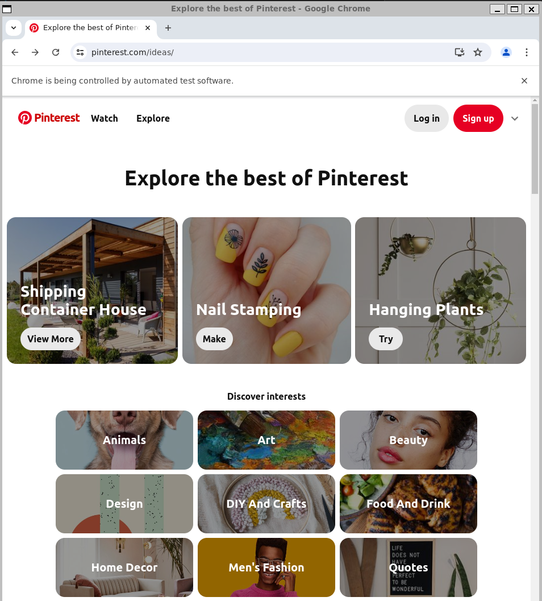

# Selenium WebDrive

> Use Selenium WebDriver se você:

- Precisa suportar vários navegadores, incluindo Chrome, Firefox, Safari, Internet Explorer e Microsoft Edge, Opera.
- Está trabalhando em um ambiente de desenvolvimento que usa várias linguagens de programação.
- Precisa executar testes em ambientes diferentes, como dispositivos móveis e navegadores diferentes.
- Tem mais experiência em automação de testes e deseja mais flexibilidade e controle sobre sua automação de testes.

> Requisitos:

- Visual Studio Code
- Extensão do Jupiter Notebook
- Selenium
- webdriver-manager
- Google-Chrome

## Python

### Preparando ambiente virtual

```bash
python3 -m venv ./venv && source venv/bin/activate
```

### Instalando o Selenium

```bash
pip install selenium
```

No caso de usar o VSCODE, instalar a extensão do Jupier Notebook

```bash
! pip install selenium
```

### Instalando o webdriver-manager 

```bash
pip install webdriver-manager 
```

### Verificando as bibliotecas que foram instaladas

```bash
pip freeze

attrs==23.2.0
certifi==2024.7.4
charset-normalizer==3.3.2
exceptiongroup==1.2.2
h11==0.14.0
idna==3.7
numpy==2.0.0
outcome==1.3.0.post0
packaging==24.1
pandas==2.2.2
PySocks==1.7.1
python-dateutil==2.9.0.post0
python-dotenv==1.0.1
pytz==2024.1
requests==2.32.3
selenium==4.22.0
six==1.16.0
sniffio==1.3.1
sortedcontainers==2.4.0
trio==0.26.0
trio-websocket==0.11.1
typing_extensions==4.12.2
tzdata==2024.1
urllib3==2.2.2
webdriver-manager==4.0.1
websocket-client==1.8.0
wsproto==1.2.0
```

Esse passo é importante, por causa das versões.

Podemos salvar essas informações em um arquivo

```bash
pip freeze > requirements.txt
```

### Instalando o Google-Chrome

Baixe o pacote `.deb` do Google Chrome:

```bash
wget https://dl.google.com/linux/direct/google-chrome-stable_current_amd64.deb
```

Instale o pacote `.deb`:

```bash
sudo apt install ./google-chrome-stable_current_amd64.deb
```

Verifique a instalação:

Após a instalação, você pode verificar se o Google Chrome está disponível executando:

```bash
google-chrome --version

Google Chrome 126.0.6478.126
```

### Projeto: 

Criar um arquivo: main.py

```bash
import time

from selenium import webdriver
from selenium.webdriver.chrome.options import Options
from selenium.webdriver.chrome.service import Service
from webdriver_manager.chrome import ChromeDriverManager
from selenium.webdriver.common.by import By

service = Service(ChromeDriverManager().install())
navegador = webdriver.Chrome(service=service)

try:
    options = Options()
    options.add_experimental_option("detach", True)
    driver = webdriver.Chrome(options=options)
    driver.get("https://www.pinterest.com/ideas/")

    # Esperar para ver o resultado
    time.sleep(10)

finally:
    # Fechar o navegador
    driver.quit()
```

### Executando

```bash
python main.py
```

O Browser do Google irá abrir com o conteúdo da pesquisa

<div aling="center">



</div>
